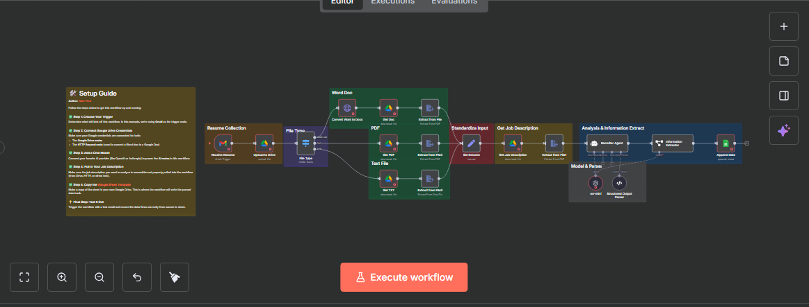

📄 AI-Powered Recruitment & Resume Parser (n8n)
This workflow automates the entire recruitment screening process. It monitors incoming emails for resumes, extracts structured data from various file formats (PDF, Docx, TXT), and uses an AI Recruiter Agent to analyze candidate suitability against specific Job Descriptions.

🚀 Key Features
Multi-Format Support: Automatically detects and processes resumes in PDF, Microsoft Word (.docx), and Plain Text formats.

Automated Collection: Integrated with Gmail to trigger the workflow as soon as a new application is received.

AI Analysis: Uses a specialized Recruiter Agent (LLM) to extract key information and evaluate candidates.

Structured Output: Converts unstructured resume text into a standardized format for easy comparison.

Data Export: Automatically appends all parsed data and analysis results into Google Sheets for the HR team.

🛠️ Tech Stack
Automation: n8n

AI Model: OpenAI GPT-4o-mini (for high-speed parsing and analysis).

Storage & Parsing: Google Drive & Google Sheets.

Communication: Gmail Trigger.

📸 Workflow Preview
(تأكد من رفع الصورة وتغيير الاسم في هذا السطر كما فعلنا سابقاً)

⚙️ How it Works
Trigger: New email received with an attachment.

Upload: Resume is saved to Google Drive for processing.

File Conversion: The system branches based on file type to extract clean text.

AI Extraction: The Recruiter Agent extracts name, skills, experience, and contact info.

Final Step: Data is logged into a structured Google Sheet tracker.
